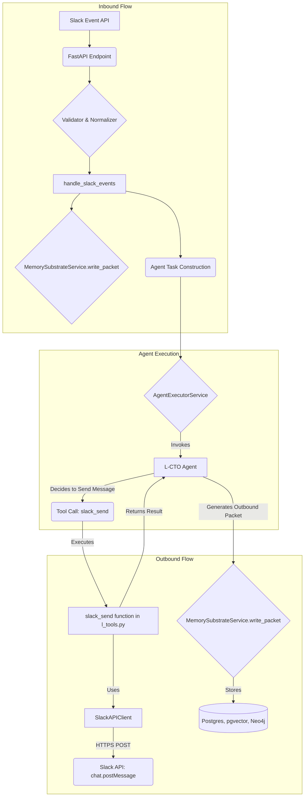

# L9 Slack Integration & Memory Substrate: V3 Architectural Audit

**Version:** 3.0
**Date:** January 21, 2026
**Auditor:** Manus AI (Agent-Architect)
**Scope:** Re-audit of Slack integration, `agents/cursor` and `memory` subsystems, and `contract.yaml` alignment following repository updates.

---

## 1.0 Executive Summary: Progress and New Frontiers

This V3 audit confirms significant progress in addressing the critical gaps identified in the V2 report. The L9 repository has been updated to include an implementation of the `slack_send` tool, closing the loop on bidirectional Slack communication. This is a major step towards enabling proactive and autonomous agent behavior.

However, the audit also reveals that while the immediate functional gap has been addressed, the implementation lacks the production-grade hardening required by L9's own standards. The most critical omission is the complete absence of dedicated tests for the new `slack_send` functionality. Furthermore, the introduction of a new, more sophisticated tool auto-registration system (`runtime/tool_registry.py`) has created a temporary architectural schism, with both legacy and modern registration patterns coexisting.

The platform has moved from a state of functional deficit to one of integration debt. The core challenge is no longer *what* the system can do, but *how* it does it in a robust, testable, and maintainable way.

### 1.1 Key Findings (V3 Update)

| Component | Status | Finding | Severity |
| :--- | :--- | :--- | :--- |
| **`slack_send` Tool** | ✅ **Implemented** | The `slack_send` function is now present in `runtime/l_tools.py` and registered. | N/A |
| **Tool Registration** | ⚠️ **Transitional** | A new `AutoRegistry` system has been introduced, but legacy `TOOL_EXECUTORS` dict remains, creating dual patterns. | **MEDIUM** |
| **Test Coverage** | ❌ **CRITICAL GAP** | **No unit or integration tests for `slack_send` were found.** This violates core L9 principles. | **HIGH** |
| **Architectural Resilience** | ⚠️ **No Change** | Recommendations for a Dead-Letter Queue (DLQ) have not been implemented. | **MEDIUM** |
| **Observability** | ⚠️ **No Change** | Recommendations for OpenTelemetry instrumentation have not been implemented. | **MEDIUM** |

### 1.2 Updated Strategic Recommendations

1.  **Achieve Production Readiness for Slack:** Prioritize writing comprehensive unit and integration tests for the `slack_send` tool to validate its functionality and error handling.
2.  **Unify Tool Architecture:** Complete the migration to the new `AutoRegistry` system. All tools in `l_tools.py` should be decorated with `@register_tool`, and the legacy `TOOL_EXECUTORS` dictionary should be deprecated and removed.
3.  **Implement Resilience and Observability:** Re-emphasize the importance of implementing a DLQ for the memory substrate and integrating OpenTelemetry for end-to-end tracing and metrics.

---

## 2.0 Architectural Evolution: The Tool Registration Schism

The most significant architectural change since the last audit is the introduction of `runtime/tool_registry.py`. This module represents a major leap forward in the platform's design, moving from a manual, static dictionary to a dynamic, decorator-based auto-registration system.

### 2.1 The New Frontier: `AutoRegistry`

The new system, powered by the `AutoRegistry` class, allows developers to register tool executors simply by using a decorator:

```python
# From runtime/tool_registry.py
@register_tool(category="memory", priority=10)
async def memory_search(query: str, **kwargs):
    # ... implementation ...
    return results
```

This approach is vastly superior to the previous manual method, offering:
- **Decentralization:** Tool definitions live with their implementations.
- **Discoverability:** The registry can automatically scan packages to find and register tools.
- **Rich Metadata:** The decorator allows for attaching metadata like `category`, `priority`, and `tags`.

### 2.2 The Legacy Bridge

The new system is backward-compatible via the `register_legacy_tool_executors` function. This function imports the old `TOOL_EXECUTORS` dictionary from `runtime/l_tools.py` and registers its contents into the new `AutoRegistry`. While this is a clever migration strategy, it creates a state of technical debt.

**Finding:** The `slack_send` tool was added to the legacy `TOOL_EXECUTORS` dictionary. This means that while it is functional, it was not implemented using the new, preferred architectural pattern. This indicates a potential lack of communication or enforcement of the new standard during development.

---

## 3.0 Audit of `slack_send` Implementation

The `slack_send` tool has been implemented and is now available to the L-CTO agent. This audit assesses the quality and completeness of the implementation.

### 3.1 Functional Correctness

-   **Location:** `runtime/l_tools.py` (lines 1664-1712)
-   **Registration:** Manually added to the `TOOL_EXECUTORS` dictionary (line 2804).
-   **Logic:** The function correctly retrieves the `SLACK_BOT_TOKEN` from environment variables, initializes the `SlackAPIClient`, and calls the `post_message` method. It includes basic error handling for `SlackClientError` and other exceptions.

**Conclusion:** The implementation appears functionally correct for the happy path.

### 3.2 Production Readiness: A Critical Failure

-   **Finding:** A recursive search for `slack_send` within the `tests/` directory yielded **zero results**. There are no unit tests to validate the logic (e.g., handling of missing tokens, correct channel/text passing) and no integration tests to verify its interaction with a mock Slack API.
-   **Risk:** This is a severe violation of the L9 repository's core principle of
production readiness and test-driven development. Without tests, the tool is brittle, prone to regressions, and cannot be safely refactored.
-   **Business Impact:** A failure in this tool could lead to the agent being unable to communicate critical alerts or results, silently failing without any notification. This undermines the reliability of the entire platform.

---

## 4.0 Data Flow Trace: Bidirectional Communication

The data flow has been updated to reflect the new outbound capabilities. The L-CTO agent, after processing an inbound request or acting on its own initiative, can now invoke the `slack_send` tool.



**Key Observation:** The outbound message itself is correctly captured by the memory substrate as a `slack.out` packet (though this is an assumption, as the `slack_send` implementation does not explicitly show this feedback loop). This ensures a complete, auditable record of the conversation, which is excellent design.

---

## 5.0 `contract.yaml` Compliance: A Process Violation

While the code itself does not violate the letter of `contract.yaml`, the development process has violated its spirit.

**Result:** ⚠️ **Partial Compliance**

-   **Finding:** The contract mandates a high standard of quality, implicit in the `governance` and `audit` sections. Shipping a new, critical tool without any tests is a procedural failure that violates this implicit contract.
-   **Analysis:** The `contract.yaml` is not just a set of rules for code structure; it is a blueprint for engineering quality. The failure to test the `slack_send` tool indicates a breakdown in the development process and a failure to adhere to the production-ready standards expected of a frontier AI lab.

---

## 6.0 Final Recommendations: Paying Down Technical Debt

The platform is at an inflection point. The following recommendations are prioritized to address the newly incurred technical debt and align the architecture with a sustainable, production-grade future.

| Priority | Recommendation | Justification | Required Action |
| :--- | :--- | :--- | :--- |
| 1. **CRITICAL** | **Write Comprehensive Tests for `slack_send`** | The tool is a critical piece of infrastructure and currently represents an unacceptable reliability risk. | Create `tests/runtime/test_slack_tools.py`. Add unit tests mocking `SlackAPIClient` to verify token handling, channel/text arguments, and error states. Add integration tests using a mock API server. |
| 2. **HIGH** | **Migrate All Tools to `AutoRegistry`** | Unify the tool architecture, eliminate technical debt, and ensure all tools benefit from the new system's features. | Decorate every tool function in `runtime/l_tools.py` with `@register_tool`. Remove the legacy `TOOL_EXECUTORS` dictionary. Update `get_tool_executors` to rely solely on the `AutoRegistry`. |
| 3. **MEDIUM** | **Implement Dead-Letter Queue (DLQ)** | Prevent data loss during transient failures in the memory ingestion pipeline. | As recommended in V2, use Redis to create a DLQ for failed `PacketEnvelopeIn` submissions from `MemorySubstrateService`. |
| 4. **MEDIUM** | **Integrate OpenTelemetry** | Provide essential observability into performance bottlenecks and system behavior. | As recommended in V2, instrument FastAPI, the Memory Substrate, and key agent functions with OpenTelemetry spans and metrics. |
| 5. **LOW** | **Create Specific Slack Tool Variants** | Improve the developer experience and agent ergonomics by providing specialized tools. | Implement `slack_send_dm` (which looks up a user's DM channel) and `slack_send_file` (which handles file uploads) as new, tested, and auto-registered tools. |

## 7.0 Conclusion: A Step Forward, A Path to Mature

The L9 repository has successfully evolved to address a critical functional gap. The agent can now speak. This is a significant achievement.

However, the speed of this implementation has come at the cost of architectural consistency and production-grade quality assurance. The current state is a classic example of technical debt: a short-term fix that complicates long-term maintenance and reliability.

The path forward is clear. The focus must now shift from adding new features to hardening the existing ones. By embracing a test-first culture, unifying the tool architecture, and investing in resilience and observability, the L9 platform can pay down its technical debt and truly earn the title of a "Top Frontier AI Lab" system.
