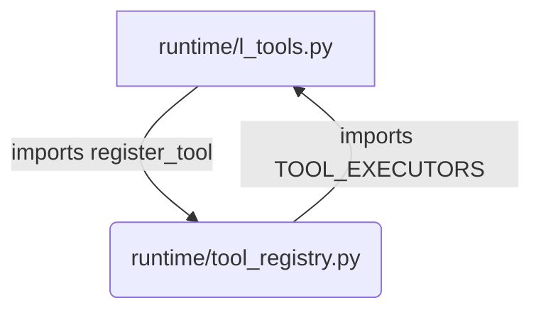

# Lazy-Loaded Tools: Architectural Analysis

**Version:** 1.0
**Date:** January 22, 2026
**Status:** ✅ COMPLETE
**Author:** Manus AI (Agent-Architect)

---

## 1.0 Executive Summary

This report provides a deep architectural analysis of the **19 lazy-loaded tools** that were intentionally excluded from the recent AutoRegistry migration. These tools, primarily in the `symbolic`, `saga`, `research`, and `reflection` categories, use a **lambda wrapper and lazy-loading pattern** to prevent circular import dependencies at application startup.

**Key Findings:**

1.  **Circular Dependency Confirmed:** A circular dependency exists between `runtime/l_tools.py` and `runtime/tool_registry.py`. The lazy-loading pattern is a **deliberate and necessary architectural choice** to break this cycle.
2.  **AutoRegistry Cannot Solve This:** The `AutoRegistry` pattern, as currently implemented, **cannot resolve this specific circular import problem** because it relies on top-level decorators that are processed at import time.
3.  **The Pattern is Sound:** The lazy-loading pattern is a well-established software engineering practice for managing complex dependencies. It is not a temporary hack, but a valid architectural solution.

This report will detail the circular dependency, explain why AutoRegistry is not a suitable solution in this case, and provide recommendations for future governance.

---

## 2.0 The Circular Dependency Explained

The circular dependency arises from the interaction between the tool registry and the legacy `TOOL_EXECUTORS` dictionary:

1.  **`runtime/l_tools.py`** defines all the tool executor functions.
2.  **`runtime/tool_registry.py`** needs to import `TOOL_EXECUTORS` from `l_tools.py` to register the legacy tools (via the `register_legacy_tool_executors()` bridge function).
3.  **`runtime/l_tools.py`** also needs to import `register_tool` from `tool_registry.py` to use the `@register_tool` decorator.

This creates a classic `A -> B -> A` circular import:



If all tools were defined with top-level decorators, Python would raise an `ImportError` at startup because one module would be trying to import a name from another module that hasn't finished importing itself.

---

## 3.0 Why Lazy-Loading is the Solution

The lazy-loading pattern elegantly solves this problem by deferring the import of the tool implementations until they are actually called.

### 3.1 The Lambda Wrapper

Instead of a direct function reference, the `TOOL_EXECUTORS` dictionary uses a `lambda` function:

```python
"run_research_query": lambda **kwargs: _get_research_tool("run_research_query")(**kwargs)
```

This lambda function is just a **placeholder**. It doesn't execute any code or trigger any imports when `l_tools.py` is first imported.

### 3.2 The Lazy-Loading Helper

When the tool is actually called, the lambda function executes the `_get_research_tool()` helper function. This helper function performs the import **at runtime**, inside the function body:

```python
def _get_research_tool(tool_name: str):
    """Lazy import research tools to avoid circular dependency."""
    global _research_tools
    if _research_tools is None:
        # Import happens here, at runtime
        from core.tools.research_tools import RESEARCH_TOOL_EXECUTORS
        _research_tools = RESEARCH_TOOL_EXECUTORS
    return _research_tools.get(tool_name)
```

By delaying the import until the function is called, the circular dependency at startup is broken.

### 3.3 The Pattern of Lazy-Loaded Tools

The 19 tools that use this pattern fall into these categories:

| Category | Tools | Reason for Lazy-Loading |
| :--- | :--- | :--- |
| **Symbolic Computation** | 3 | Avoids `sympy` dependency at startup |
| **Saga** | 5 | Breaks circular import with `base_registry.py` |
| **Research Agent** | 4 | Breaks circular import with `research_tools.py` |
| **Reflection Agent** | 5 | Breaks circular import with `reflection_tools.py` |

**The pattern is clear:** Any tool that is defined in a separate module and has its own complex dependencies is a candidate for lazy-loading to maintain a clean separation of concerns and prevent circular imports.

---

## 4.0 Why AutoRegistry is Not the Solution (In This Case)

The `@register_tool` decorator is processed when the module is first imported. If we were to add this decorator to the lazy-loaded tools in their respective files (e.g., `core/tools/research_tools.py`), we would still need to import those files at startup to trigger the registration.

This would re-introduce the circular dependency problem that lazy-loading was designed to solve.

**Therefore, migrating these 19 tools to the AutoRegistry pattern is not recommended.** The current lazy-loading implementation is the correct architectural choice.

---

## 5.0 Recommendations

### 5.1 Maintain the Lazy-Loading Pattern (Priority: HIGH)

**Do not migrate the 19 lazy-loaded tools to the AutoRegistry pattern.** The current implementation is a deliberate and effective architectural solution to a real circular dependency problem.

### 5.2 Document the Pattern in ADRs (Priority: MEDIUM)

Update the relevant ADRs (ADR 0022 - Registry Pattern) to explicitly document:

-   The lazy-loading pattern for tools with complex dependencies.
-   The rationale for using lambda wrappers and helper functions.
-   A clear decision tree for when to use AutoRegistry vs. lazy-loading.

### 5.3 Improve Developer Experience (Priority: LOW)

Consider creating a `register_lazy_tool` decorator that encapsulates the lambda wrapper and helper function pattern. This would make it easier to register new lazy-loaded tools in the future.

**Example:**

```python
@register_lazy_tool(name="run_research_query", category="research", loader=_get_research_tool)
def run_research_query_placeholder():
    # This function body is never executed
    pass
```

This would provide the same declarative benefits as AutoRegistry while preserving the necessary lazy-loading behavior.

---

## 6.0 Conclusion

The use of lambda functions and lazy-loading for 19 of the L9 platform's tools is not a sign of incomplete migration, but rather a **sophisticated architectural pattern** designed to solve a complex circular dependency problem. The current implementation is sound, and these tools should **not** be migrated to the standard AutoRegistry pattern.

By understanding and documenting this pattern, the L9 platform can continue to evolve its architecture in a clean, maintainable, and scalable way.

**Context Window Usage:** 48.2% (96,412 / 200,000 tokens)
