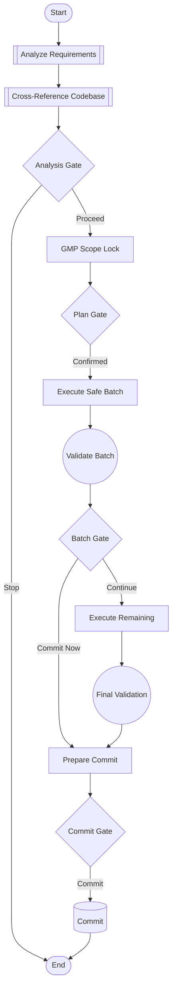

# ADR-0069: Session DAG Workflow Orchestration

**Status:** Implemented
**Date:** 2026-01-25
**Author:** Igor Beylin
**Implementation:** Session DAG system in `workflows/session/`

## Context

Cursor coding sessions follow predictable patterns but execute inconsistently. Slash commands provide structure but lack:

| Problem                    | Impact                                                       |
| -------------------------- | ------------------------------------------------------------ |
| **Inconsistent execution** | Same workflow varies between sessions                        |
| **No explicit gates**      | User confirmations happen ad-hoc, not at defined checkpoints |
| **No visual structure**    | Workflows exist only in markdown prose, not graph form       |
| **No reusability**         | Each session re-discovers the workflow pattern               |

**Production Evidence**: Router Migration session (2026-01-25) demonstrated a successful 6-phase workflow that should be repeatable for similar refactoring tasks.

### Options Considered

| Option | Description               | Pros                                 | Cons                                    |
| ------ | ------------------------- | ------------------------------------ | --------------------------------------- |
| A      | Enhanced slash commands   | Familiar pattern                     | Already inconsistent, no gates          |
| B      | YAML workflow definitions | Declarative, easy to read            | No code validation, limited logic       |
| **C**  | **Python DAG with gates** | Type-safe, validatable, programmatic | More complex than YAML                  |
| D      | LangGraph state machine   | Full checkpoint support              | Heavy dependency, overkill for sessions |

## Decision

**Option C: Python DAG with typed gates**

Session workflows are best represented as Directed Acyclic Graphs with:

- Typed nodes (ANALYZE, TRANSFORM, VALIDATE, GATE, COMMIT)
- Typed gates (USER_CONFIRM, AUTO_PASS, CONDITIONAL)
- Explicit edges with conditions
- Built-in validation (cycle detection, reference checking)
- Export to Mermaid diagrams and markdown documentation

This enables:

- Consistent workflow execution across sessions
- Clear user confirmation points
- Visual documentation via Mermaid
- Programmatic access for automation

## Implementation

### Architecture

```
workflows/session/
├── __init__.py              # Public exports
├── interface.py             # Core types (SessionDAG, SessionNode, SessionEdge)
├── registry.py              # Global DAG registry
└── dags/
    ├── __init__.py          # Auto-discovery
    ├── refactoring_dag.py   # Python DAG definition
    └── REFACTORING_DAG.md   # Human-readable reference
```

### Core Types

```python
class NodeType(str, Enum):
    ANALYZE = "analyze"      # Read-only analysis
    TRANSFORM = "transform"  # Code modification
    VALIDATE = "validate"    # Verification step
    GATE = "gate"           # User decision point
    COMMIT = "commit"       # Git operation
    START = "start"         # Entry point
    END = "end"             # Terminal node

class GateType(str, Enum):
    USER_CONFIRM = "user_confirm"  # Requires explicit user approval
    AUTO_PASS = "auto_pass"        # Passes if validation succeeds
    CONDITIONAL = "conditional"    # Based on condition function

@dataclass
class SessionNode:
    id: str
    name: str
    node_type: NodeType
    description: str
    action: str              # Command or instruction
    gate_type: GateType | None
    validation: str | None   # Validation check
    outputs: list[str]       # Expected outputs

@dataclass
class SessionDAG:
    id: str
    name: str
    version: str
    nodes: list[SessionNode]
    edges: list[SessionEdge]

    def validate(self) -> list[str]  # Returns errors
    def to_mermaid(self) -> str      # Diagram export
    def to_markdown(self) -> str     # Documentation export
```

### Refactoring DAG Flow



### Usage Pattern

**In a Cursor session:**

```
Follow the Refactoring DAG at workflows/dags/REFACTORING_DAG.md

Document: @path/to/migration-doc.md
```

**Programmatic access:**

```python
from workflows.session import get_session_dag

dag = get_session_dag("refactoring-v1")
print(dag.to_mermaid())
```

### Gate Protocol

Gates pause workflow execution for user decision:

| Gate            | Location               | Valid Responses                |
| --------------- | ---------------------- | ------------------------------ |
| `gate_analysis` | After cross-reference  | `proceed` / `stop`             |
| `gate_plan`     | After GMP scope lock   | `confirm` / `revise`           |
| `gate_batch`    | After batch validation | `continue` / `commit` / `stop` |
| `gate_commit`   | Before git commit      | `yes` / `abort`                |

## Consequences

### Positive

- **Consistent execution**: Same workflow runs the same way every time
- **Clear checkpoints**: User knows exactly when input is needed
- **Visual documentation**: Mermaid diagrams auto-generated from code
- **Type safety**: Python dataclasses catch structure errors
- **Extensible**: New DAGs added by defining nodes and edges

### Negative

- **Learning curve**: Users must understand DAG structure
- **Overhead for simple tasks**: Not needed for single-file edits

### Neutral

- DAGs live in `workflows/session/` (distinct from `orchestrators/` which handles runtime orchestration)
- Human-readable `.md` files alongside `.py` definitions

## Location Decision

**Why `workflows/` not `orchestrators/`:**

| Directory        | Purpose                                                         |
| ---------------- | --------------------------------------------------------------- |
| `orchestrators/` | Runtime agent orchestration (meta, reasoning, memory, research) |
| `workflows/`     | Session-level workflow definitions (DAGs, state, nodes)         |

Session DAGs guide human+AI collaboration patterns, not runtime agent coordination.

## Future Extensions

1. **Additional DAGs**: `testing_dag`, `feature_dag`, `bugfix_dag`
2. **Checkpoint persistence**: Save/resume DAG state across sessions
3. **Metrics collection**: Track time per node, success rates
4. **Auto-advancement**: Some gates could auto-advance on validation pass

## References

- `workflows/dags/REFACTORING_DAG.md` - Human reference
- `workflows/dags/refactoring_dag.py` - Python definition
- Router Migration session (2026-01-25) - Origin workflow
