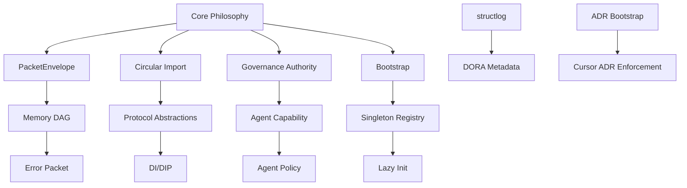

# Architecture Decision Records (ADRs)

This directory contains Architecture Decision Records for the L9 codebase.

## 🚀 AI Agent Bootstrap Protocol (ADR-0035)

**MANDATORY**: All AI agents (Cursor, Claude Code, L-CTO, CodeGenAgent) MUST:

1. **Read this README** at session startup.
2. **Scan all `Status: Accepted` ADRs** — apply their constraints during code analysis/generation.
3. **Check proposed changes** against CRITICAL-tier ADRs before committing.
4. **Treat ADR violations as blockers** — do not merge violating code.
5. **Update `workflow_state.md`** after any ADR-governed implementation.

---

## 🛡️ Priority Tiers

Not all ADRs are equal. Focus attention based on tier:

### 🔴 CRITICAL — Must-Read Before Any Code Change

These ADRs enforce safety, audit, and structural invariants. Violating them breaks the system.

| ADR | Title | Constraint |
|-----|-------|------------|
| [0002](./0002-circular-import-prevention.md) | Circular Import Prevention | Use `TYPE_CHECKING` for type-only imports |
| [0006](./0006-packet-envelope-audit-trail.md) | PacketEnvelope Audit Trail | All operations emit PacketEnvelope |
| [0012](./0012-memory-dag-pipeline.md) | Memory DAG Pipeline | Validation in `intake_node` only; no duplicate validation |
| [0014](./0014-dora-metadata-block.md) | DORA Metadata Block | Every module needs `__dora_meta__` dict |
| [0019](./0019-structlog-logging-standard.md) | structlog Logging | Use structlog, never `print()` or `logging` |
| [0055](./0055-fail-loudly-vs-graceful-degradation.md) | Fail-Loudly vs Graceful Degradation | Explicit failure semantics; no silent swallowing |
| [0087](./0087-sql-parameterization.md) | SQL Parameterization | Never use f-strings for SQL; always parameterize |
| [0088](./0088-no-pickle-serialization.md) | No Pickle Serialization | Never use pickle; use JSON/msgpack |
| [0091](./0091-definition-of-done.md) | Definition of Done | Enforceable DoD for all commits |
| [0094](./0094-tool-registry-primary-pipeline-unification.md) | Tool Registry Primary Pipeline Unification | New code must use ExecutorToolRegistry/base registry/dynamic discovery primary path |

### 🟡 IMPORTANT — Read When Working in Related Area

| ADR | Title | Area |
|-----|-------|------|
| [0004](./0004-singleton-auto-registry.md) | Singleton Auto-Registry | Singletons, DI |
| [0013](./0013-governance-authority-hierarchy.md) | Governance Authority | Approval gates |
| [0026](./0026-protocol-based-abstractions.md) | Protocol-Based Abstractions | Interfaces |
| [0052](./0052-di-dip-foundation.md) | DI/DIP Foundation | Dependency injection |
| [0064](./0064-dynamic-tool-discovery.md) | Dynamic Tool Discovery | Tool discovery |
| [0068](./0068-unified-resilience-protocol-layer.md) | Unified Resilience Protocol | Error handling |

---

## 🗺️ ADR Dependency Map

---

## 📋 Compliance Checklist for Agents

- [ ] Does the module have a `__dora_meta__` block? (ADR-0014)
- [ ] Are all imports circular-safe using `TYPE_CHECKING`? (ADR-0002)
- [ ] Does every significant operation emit a `PacketEnvelope`? (ADR-0006)
- [ ] Are all database queries parameterized? (ADR-0087)
- [ ] Is `structlog` used instead of `print()`? (ADR-0019)
- [ ] Are exceptions handled with explicit failure packets? (ADR-0055)
- [ ] Does the implementation follow the 7-phase bootstrap if applicable? (ADR-0007)

---

## 📂 ADR Inventory by Domain

### 🧠 Memory & Learning
- [0006](./0006-packet-envelope-audit-trail.md) - PacketEnvelope Audit Trail
- [0012](./0012-memory-dag-pipeline.md) - Memory DAG Pipeline
- [0029](./0029-embedding-generation-pipeline.md) - Embedding Generation Pipeline
- [0047](./0047-memory-facade-decomposition.md) - Memory Facade Decomposition

### 🛡️ Governance & Security
- [0013](./0013-governance-authority-hierarchy.md) - Governance Authority Hierarchy
- [0034](./0034-agent-capability-scoping.md) - Agent Capability Scoping
- [0078](./0078-explicit-approval-destructive-ops.md) - Explicit Approval for Destructive Ops
- [0090](./0090-no-hardcoded-credentials-in-rules.md) - No Hardcoded Credentials

### 🏗️ Architecture & DI
- [0004](./0004-singleton-auto-registry.md) - Singleton Auto-Registry
- [0026](./0026-protocol-based-abstractions.md) - Protocol-Based Abstractions
- [0052](./0052-di-dip-foundation.md) - DI/DIP Foundation
- [0085](./0085-thread-safe-singletons.md) - Thread-Safe Singleton Pattern

---

## 🔄 ADR Lifecycle

| Status | Meaning |
|--------|---------|
| **Proposed** | Under review, not yet binding |
| **Accepted** | **Binding contract** for all agents |
| **Implemented** | Fully integrated into the codebase |
| **Deprecated** | Still present but use is discouraged |
| **Superseded** | Replaced by a newer ADR |

---

## 🛠️ ADR Format (AI-Optimized)

All ADRs MUST follow the structure defined in `config/schemas/adr_schema.yaml`:

1. **Status**: Current lifecycle state.
2. **Pattern**: One-line description.
3. **Minimal Implementation**: Copy-pasteable code example.
4. **Anti-Pattern**: Examples of what NOT to do.
5. **AI Guidance**: Explicit DO/DO NOT rules.

---

## ➕ Creating New ADRs

1. Use next sequential number: `0098-short-title.md`. (Duplicate ADR numbers 0041, 0043, and 0066 were resolved by renumbering the second of each pair to 0095, 0096, 0097.)
2. Follow the AI-Optimized format.
3. Update this README and `reports/repo-index/adr_catalog.txt`.
4. Run `make ci-validate` to ensure schema compliance.
