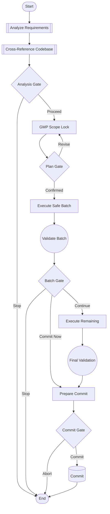

# Refactoring Workflow DAG

**Version:** 1.0.0
**ID:** `refactoring-v1`

Systematic refactoring/migration workflow with safety gates.

## When to Use

- Migrating code patterns (e.g., manual → auto-registration)
- Refactoring modules across multiple files
- Applying systematic changes with verification

## Workflow Diagram



## Phases

### Phase 1: ANALYZE

| Step               | Action                         | Output                               |
| ------------------ | ------------------------------ | ------------------------------------ |
| `analyze_document` | `/analyze_evaluate {document}` | Claims, file paths, proposed changes |
| `cross_reference`  | Verify claims vs codebase      | Verified claims, discrepancies       |
| `gate_analysis`    | User confirms findings         | Proceed or Stop                      |

### Phase 2: PLAN

| Step                | Action                 | Output                 |
| ------------------- | ---------------------- | ---------------------- |
| `create_scope_lock` | GMP Phase 0 scope lock | TODO plan, file budget |
| `gate_plan`         | User confirms plan     | CONFIRM to proceed     |

### Phase 3: EXECUTE

| Step                 | Action                       | Output               |
| -------------------- | ---------------------------- | -------------------- |
| `execute_safe_batch` | Execute low-risk items first | Modified files       |
| `validate_batch`     | py_compile, ruff, lints      | Validation results   |
| `gate_batch`         | Continue, Commit, or Stop    | Next action          |
| `execute_remaining`  | Execute remaining items      | All changes complete |
| `final_validation`   | Full validation suite        | Ready for commit     |

### Phase 4: COMMIT

| Step             | Action                       | Output                |
| ---------------- | ---------------------------- | --------------------- |
| `prepare_commit` | Stage files, prepare message | Staged files, message |
| `gate_commit`    | User confirms commit         | YES/ABORT             |
| `commit`         | Execute git commit           | Commit hash           |

## Usage in Cursor Session

To use this DAG, tell the agent:

```
Follow the Refactoring DAG at workflows/session/dags/REFACTORING_DAG.md

Document to analyze: {path/to/document.md}
```

Or reference specific phases:

```
We're at step `execute_safe_batch` in the Refactoring DAG.
Execute the safe batch for {files}.
```

## Gate Responses

| Gate            | Valid Responses                |
| --------------- | ------------------------------ |
| `gate_analysis` | `proceed` / `stop`             |
| `gate_plan`     | `confirm` / `revise`           |
| `gate_batch`    | `continue` / `commit` / `stop` |
| `gate_commit`   | `yes` / `abort`                |

## Validation Requirements

Each validation step must pass:

1. **Syntax:** `python3 -m py_compile {files}`
2. **Linting:** `ruff check {files} --select=E,F,I`
3. **Import sort:** `ruff check {files} --select=I --fix`
4. **IDE lints:** `ReadLints {files}`
5. **Scope drift:** Git diff matches TODO plan

## Example Session

```
User: Follow the Refactoring DAG for @migration-document.md

Agent: [Executes analyze_document]
       [Executes cross_reference]
       [Presents gate_analysis]

       ## Analysis Results
       ### Verified ✅
       - 17 manual routers in server.py
       - 19 auto-registered routers

       ### Discrepancies ⚠️
       - 5 file paths incorrect in document

       ⏸️ AWAITING: proceed or stop?

User: proceed

Agent: [Executes create_scope_lock]
       [Presents gate_plan with TODO table]

       ⏸️ AWAITING: CONFIRM

User: CONFIRM

Agent: [Executes execute_safe_batch]
       [Executes validate_batch]
       ...continues through DAG...
```

## Related DAGs

- (Future) `testing_dag` - Systematic test writing workflow
- (Future) `feature_dag` - New feature implementation workflow
- (Future) `bugfix_dag` - Bug investigation and fix workflow
